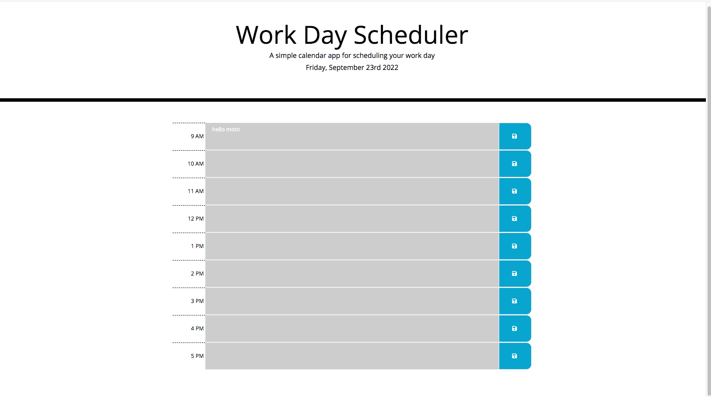
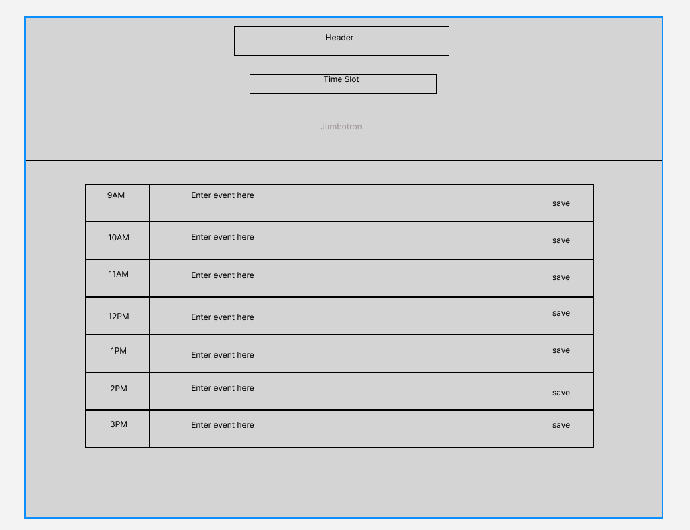

# Work-Schedule

## Description

The motivation for this project was to build a work day scheduling application for the busy web developer and other working professionals so that they can plan out their days to be the most productive. I built this project for myself but to also share with others who like me, have plenty of things to do in the day and don't have the mental capacities to remember it all. This solves the problem of forgetting important, upcoming things that we often put to the side for the stuff we're currently working on. We can simply just log everything at the beginning of the day, and check each hour to make sure we are on schedule. From working on this project I've learned how to use Third-party apps to make my page both stylish and dynamic, and how to use local storage to effectively save information on my page, even after closing my browser.

## Feature

* You can schedule an event for every hour from 9am to 5pm

* The schedule dynamically lets users know what hour they are currently on, what hours have passed, and what hours are coming up

* You can save your events in the browser and your events will be stored in their respective time slots even when you close the browser

* The schedule will reset their time slots every 24 hours

## Usage

The way this application is to be used is to put your events in their respective time slots. Before you start your day at 9am you can open up the app and start adding things in. After every hours passed, you can take a look at the schedule to see what you have next. Don't worry about clearing your schedule because the app will do that for you.

## Demo

This is the functionality of my scheduling application

## Wire Frame

This is the wire frame design

## Deployed Application

Check out the live website here! : https://keysbhag.github.io/Work-Schedule/

## Credits

Keyshawn Bhagwandin Git Repo: https://github.com/keysbhag/Work-Schedule

## License

N/A

---
© 2022 Keysbhag. Confidential and Proprietary. All Rights Reserved.